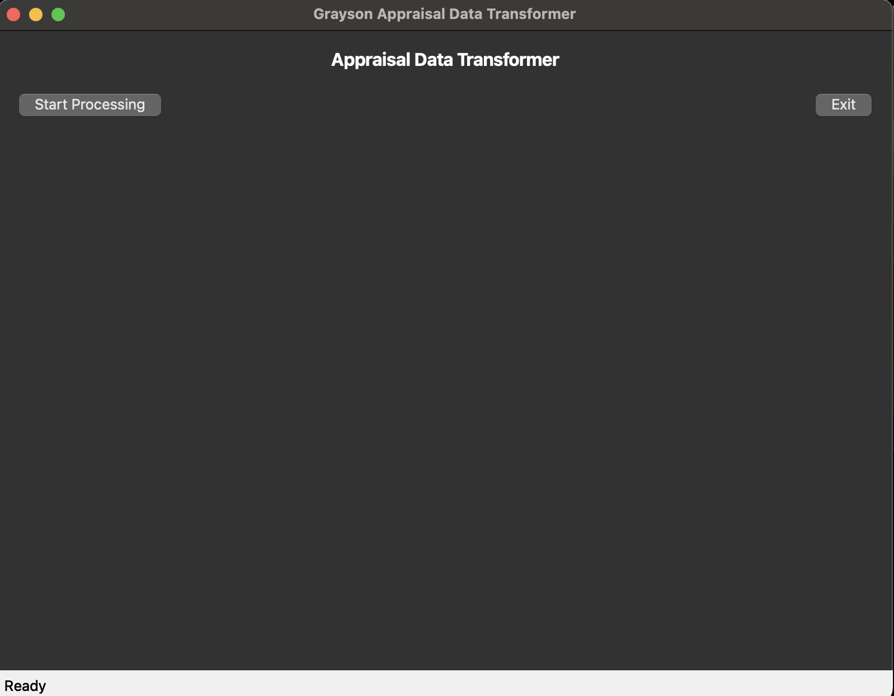

# Grayson Appraisal Data Transformer

**The Grayson Appraisal Data Transformer is a desktop application that automates the download and processing of appraisal data from Grayson County's mapping service. It extracts text files from a zip archive and transforms them into a structured Excel spreadsheet for easier data analysis and reporting.**



## Features

- **Automated Data Download**: Downloads appraisal data zip files from Grayson County's mapping service
- **Excel Generation**: Converts raw appraisal data into structured Excel format with proper formatting
- **Memory Efficient Processing**: Processes large datasets in chunks of 10,000 records per iteration to handle 115k+ records efficiently
- **Logging**: Comprehensive logging system for troubleshooting and audit trails
- **Error Handling**: Robust error handling with user-friendly error messages

## Requirements

- Python 3.7+
- PyQt5
- pandas
- openpyxl
- requests

## Installation

1. Clone or download this repository
2. Install required dependencies:
   ```bash
   pip install -r requirements.txt
   ```

## Usage

1. Run the application:
   ```bash
   python main.py
   ```
2. Click the "Start" button to begin processing
3. The application will:
   - Download the latest appraisal data zip file
   - Extract the contents
   - Process the appraisal info text files
   - Generate an Excel file with the current date

## Output

The application generates an Excel file named `Appraisal_Data_YYYYMMDD.xlsx` in the current directory containing the processed appraisal data.